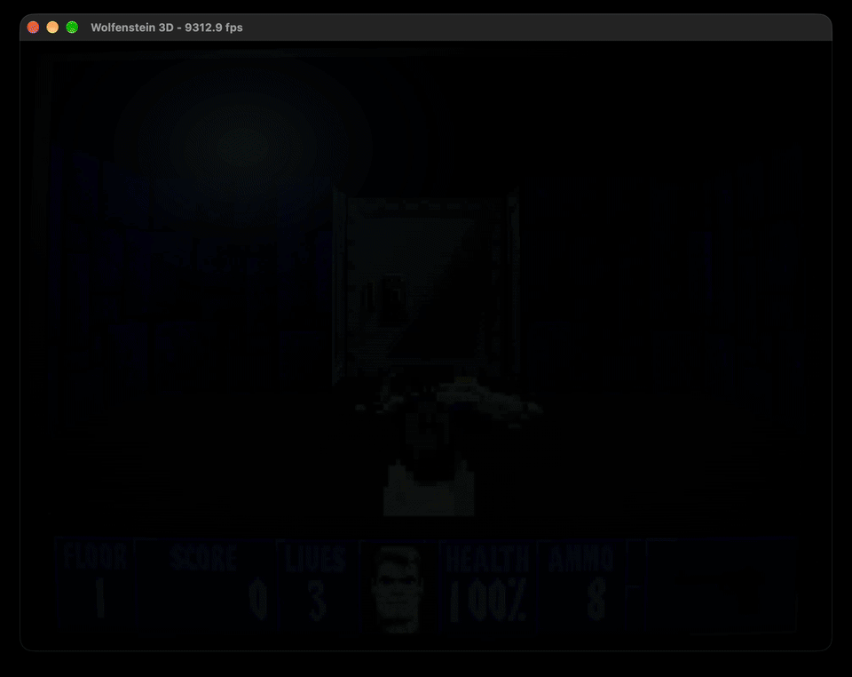

# Wolf3D

This is a port of Wolfenstein 3D to JetScheme. The game logic and software renderer are written entirely in Scheme and run on JetScheme's bytecode interpreter. YMFM emulates the AdLib synthesizer. JetScheme's `dos` module handles input, audio, framebuffer display, and super fun CRT emulation.

The port requires the original `.WL6` game data and `OBJ/GAMEPAL.OBJ` from the Wolf3D source release. After building JetScheme, run the port from this directory:

```sh
../../build/jet wolf3d.ss --datadir /path/to/wolf3d-data
```



See `COPYING` for the source-code license.
